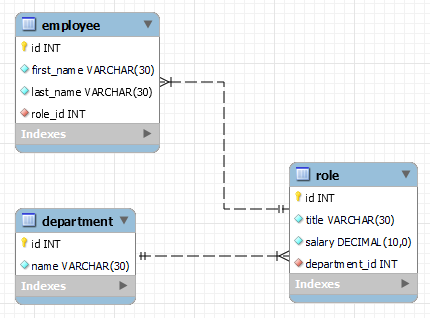

 
# Employee Tracker
## Licensing:

## Description
This command-line app will allow a user to view, enter, and update a company's departments, roles, and employees. It was created using an express back end and MySQL database. 

## Table of Contents
* [Installation](#Installation)
* [Usage](#Usage)
* [Technologies](#Technologies)
* [Contributors](#Contributors)
* [Questions](#Questions)
## Installation
Download the package to your local environment, run npm init, and install the depencies. 
## Usage
This app runs from the command line by using 'node employeeTracker.js' to initiate. 

### *Application Video Demo*

### *Schema*

## Technologies
* JavaScript
* Node.js
* Express.js
* MySQL
* Inquirer
* and other npm packages
## Contributors
If you would like to contribute to this project, please email me at the address below.
## Future Considerations
Delete records, join tables, view the budget for all employee salaries.
## Questions 
#### Please contact me by email.
https://github.com/shelleymcq or email me at shelleymcq.dev@gmail.com
